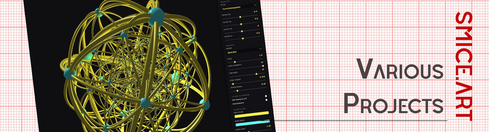
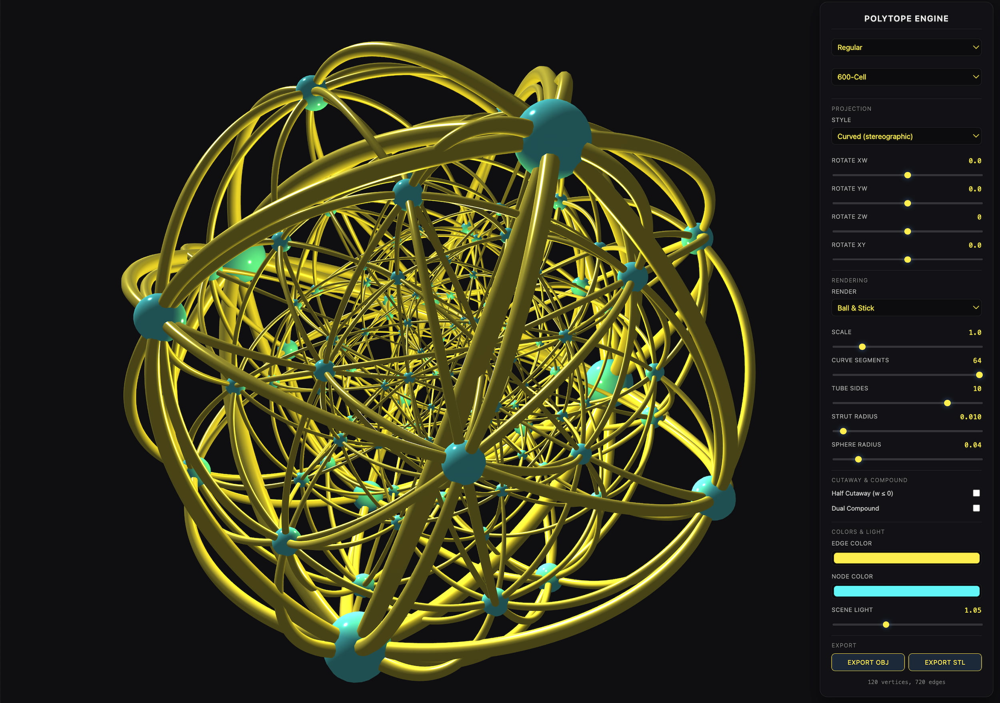

  

# 4D Polytope Web Engine

# The Project
The idea behind this add-on was to make it possible, beside "jenn3D" or other great online tools, to create polytope inside blender. The development of this add-on was inspired by D.Krider, who recently added a Blender add-on to the Blender add-on portal. Those who don't want to create their own polytopes can purchase a set of 120 objects as an asset for Blender on the Superhive Market. My thanks go to D.Krider for the impetus to complete the add-on and to Fritz Obermeyer, the developer of Jenn3D, who first published a good online version.

# Key Features
* You have many slider to adjust the Polytope parameter.
* You can export objects in stl or obj
* There are several templates integrated

# Screen Shot (click to visit)

| Object | Preview |
| :--- | :--- |
|  |  |
|  |  |
